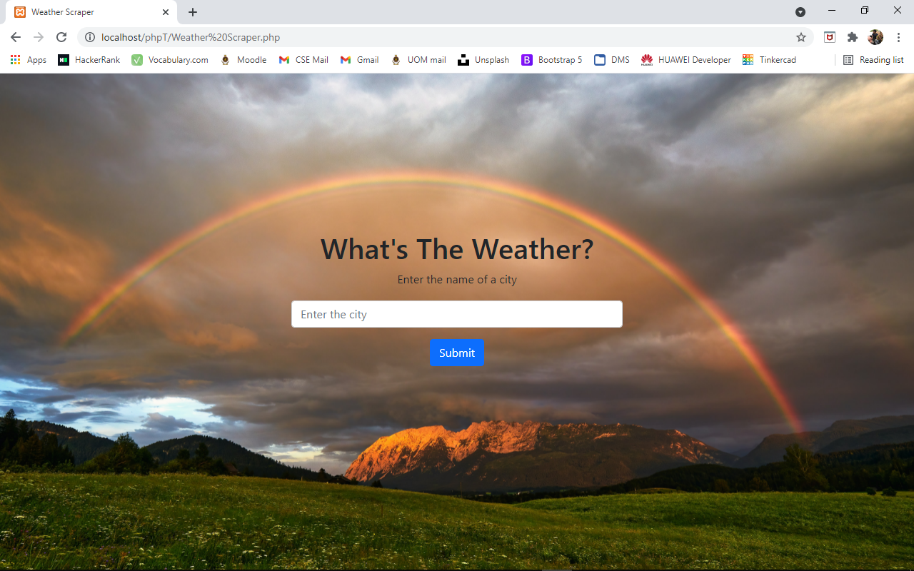
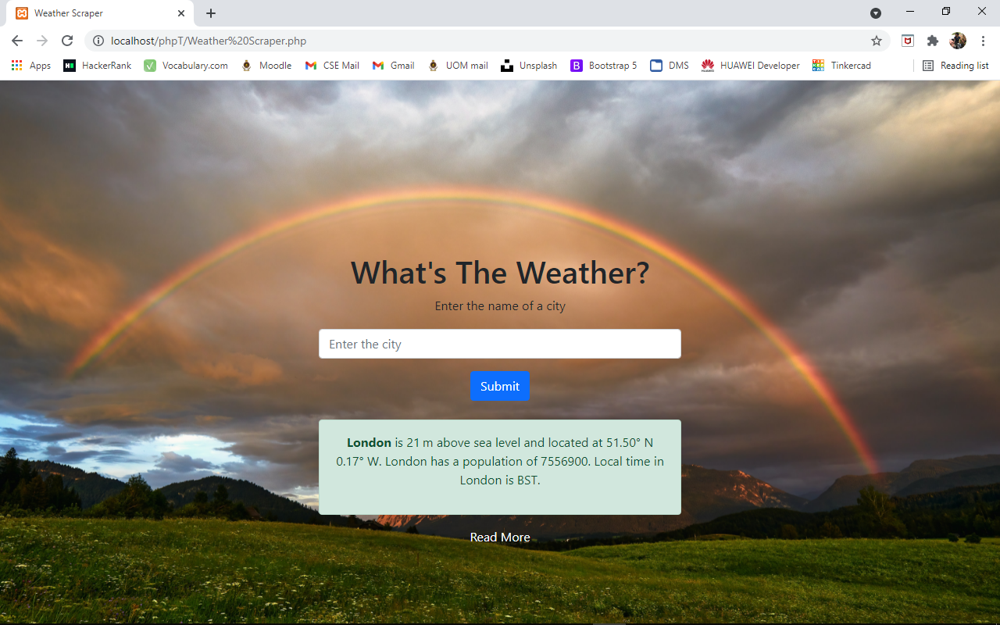
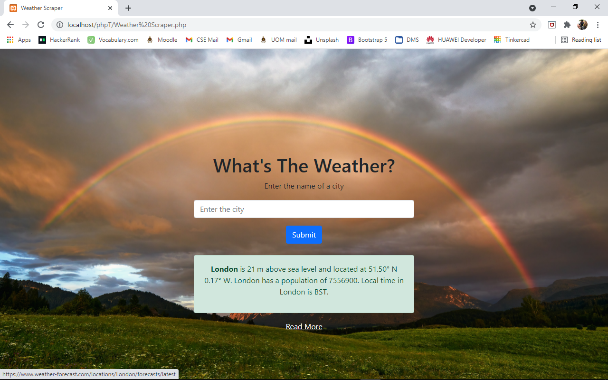
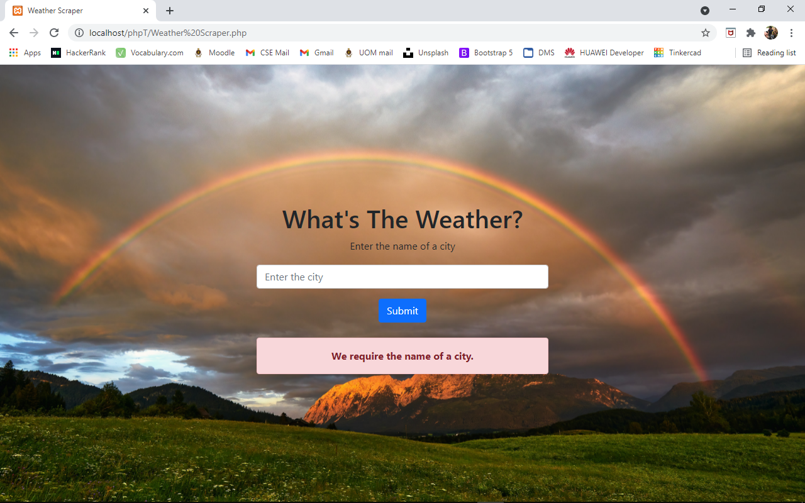
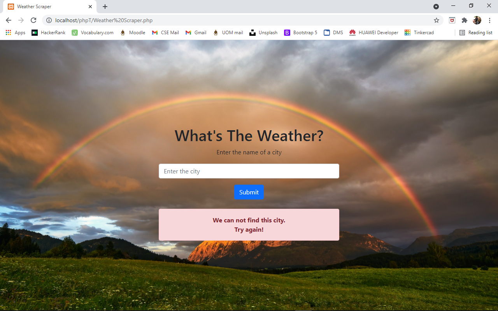

# Weather Scraper

Tools: HTML, CSS, JavaScript, Bootstrap, jQuery, PHP

- Created my first responsive website without a database.
- Enabled users to find the weather report for any city through the site.
- Gathered real-time weather data from an external website.

## Demo

https://github.com/user-attachments/assets/a28bd02b-8828-4f3e-882e-6d0202ab1e7d

## Screenshots

|  |  |
|--------------------------|--------------------------|
|  |  |
|  ||
